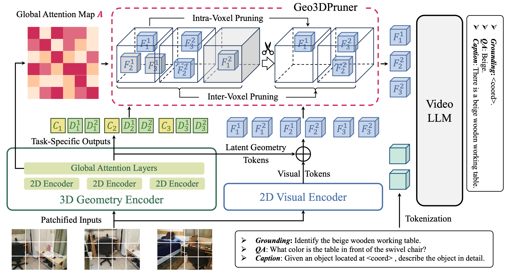
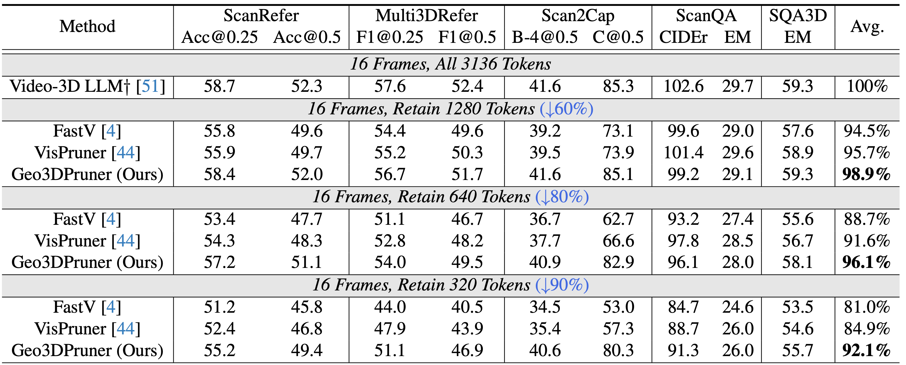

# Geo3DPruner
This repo is the official PyTorch implementation for paper: [Geometry-Guided 3D Visual Token Pruning for Video-Language Models](https://arxiv.org/pdf/2604.18260). Accepted by **CVPR 2026**.



Multimodal large language models have demonstrated remarkable capabilities in 2D vision, motivating their extension to 3D scene understanding. Recent studies represent 3D scenes as 3D spatial videos composed of image sequences with depth and camera pose information, enabling pre-trained video-language models to perform 3D reasoning tasks. However, the large number of visual tokens in spatial videos remains a major bottleneck for efficient inference and context management. Existing pruning methods overlook the view consistency of spatial videos and the spatial diversity of the remaining tokens, which prevents them from effectively removing inter-frame redundancy and preserving scene completeness. In this paper, we propose **Geo3DPruner**, a **Geo**metry-Guided **3D** Visual Token **Prun**ing framework. Geo3DPruner first models cross-frame relevance through geometry-aware global attention, and then performs a two-stage pruning process. The intra-voxel stage selects representative multi-view features within each voxel, while the inter-voxel stage preserves spatial diversity by selecting a globally distributed subset of voxels. Extensive experiments on multiple 3D scene understanding benchmarks demonstrate that Geo3DPruner retains over 90\% of the original performance while pruning 90\% of visual tokens, significantly outperforming existing text-guided and vision-guided pruning methods.

## Main Results



$\dagger$: We introduce an additional 3D encoder to replace the original 3D positional embeddings following VG LLM.

## Citation
If you find this repo useful for your research, please consider citing it using the following BibTeX entry.

```
@article{li2026geometry,
  title={Geometry-Guided 3D Visual Token Pruning for Video-Language Models},
  author={Li, Han and Huang, Zehao and Fu, Jiahui and Wang, Naiyan and Liu, Si},
  journal={arXiv preprint arXiv:2604.18260},
  year={2026}
}
```

## Acknowledgement
We thank the authors that open the following projects.
- [VGGT](https://github.com/facebookresearch/vggt)
- [StreamVGGT](https://github.com/wzzheng/StreamVGGT)
- [Video-3D LLM](https://github.com/LaVi-Lab/Video-3D-LLM)
- [VG LLM](https://github.com/LaVi-Lab/VG-LLM)
